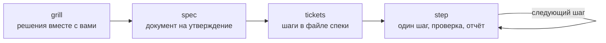

# 1c-ai-skills

Скиллы для [Claude Code](https://claude.com/claude-code), которые помогают вести разработку на 1С
вместе с ИИ-агентом: от разбора задачи до проверенного изменения.

Агент без правил быстро пишет код, но на 1С он чаще всего ошибается не в синтаксисе, а в месте:
дописывает в каждый вызывающий модуль вместо общей процедуры, выбирает `&Вместо` там, где хватило
бы переопределяемого модуля БСП, забывает про права и реструктуризацию. Эти скиллы заставляют
агента сначала договориться с вами о решении, зафиксировать его и только потом делать работу
маленькими проверяемыми шагами.

[English version](README.en.md)

## Что внутри

Один плагин `1c-dev` с девятью скиллами. Четыре ведут цикл работы над задачей:

| Команда | Что делает |
|---|---|
| `/1c-dev:grill` | Допрашивает вас по задаче раундами, пока не появится общее понимание. Факты из конфигурации собирает сам, спрашивает только решения |
| `/1c-dev:spec` | Превращает обсуждение в техническую спеку: метаданные, движения, точка врезки, права, проверка. Сохраняет её файлом |
| `/1c-dev:tickets` | Режет спеку на шаги, после каждого из которых база рабочая, с зависимостями и исполнителем |
| `/1c-dev:step` | Берёт первый свободный шаг, делает, проверяет, докладывает и останавливается |

Пять помогают писать код и настраивают плагин:

| Команда | Что делает |
|---|---|
| `/1c-dev:bsl-standards` | Правила стандартов 1С (ИТС), на которых агент ошибается или которые появились недавно: исключения, транзакции, пакетная запись регистров, файлы, длительные операции, клиент-сервер, запросы, HTTPS и внешний код, обработчики записи |
| `/1c-dev:bsl-module-skeleton` | Структура модуля по стандарту: области и их порядок для общего модуля, модуля объекта, формы и команды |
| `/1c-dev:yaxunit-test-skeleton` | Заготовка тестового модуля YAxUnit |
| `/1c-dev:vanessa-pitfalls` | Справка по граблям Vanessa Automation: кодировки, пароль тест-клиента, таймауты, диалект шагов, фикстуры |
| `/1c-dev:setup` | Настройки плагина под проект |

`grill`, `bsl-standards`, `bsl-module-skeleton`, `yaxunit-test-skeleton` и `vanessa-pitfalls`
агент может вызвать сам, когда видит подходящую ситуацию. Остальные запускаются только вашей
командой.

В справочные скиллы вошли только темы, где проверка показала разницу: агент со скиллом пишет
код по стандарту, а без него ошибается. Правила пересказаны своими словами с номером стандарта
ИТС; полный текст стандартов доступен по подписке на its.1c.ru.

## Установка

В Claude Code выполните две команды:

```
/plugin marketplace add blessed2k/1c-ai-skills
/plugin install 1c-dev@1c-ai-skills
```

После установки перезапустите сессию и запустите `/1c-dev:setup` в папке своего проекта.

Обновление в два шага: `/plugin marketplace update 1c-ai-skills` обновляет каталог, затем
`/plugin update 1c-dev@1c-ai-skills` ставит новую версию. После обновления перезапустите сессию.

### Другие агенты

Скиллы написаны в открытом формате `SKILL.md`. Если ваш агент его понимает, скопируйте нужные
папки из `plugins/1c-dev/skills/` в его каталог скиллов. Работоспособность гарантируется только
в Claude Code: команды вида `/1c-dev:spec` и запрет на самостоятельный вызов скилла там могут
работать иначе.

## Быстрый старт

1. `/1c-dev:setup`: ответьте на вопросы, файл настроек появится в `.claude/1c-dev.md`.
2. Опишите задачу своими словами и запустите `/1c-dev:grill`.
3. Когда агент перечислит решения и вы подтвердите понимание, запустите `/1c-dev:spec`.
4. Утвердите спеку, затем `/1c-dev:tickets`: шаги допишутся в файл спеки.
5. `/1c-dev:step` столько раз, сколько шагов. Каждый вызов делает ровно один шаг.

## Цикл работы



Каждый переход вы запускаете сами: агент не начинает код, пока не утверждена спека, и не берёт
следующий шаг без вашей команды. Подробно, с примером задачи: [docs/workflow.md](docs/workflow.md).

Чего агент не делает ни на одном этапе: не загружает конфигурацию в базу, не обновляет структуру
базы, не пишет данные и не работает с хранилищем. Он готовит всё к запуску и говорит, что нужно
сделать вам.

## Настройки

Плагин работает и без настроек, но лучше потратить минуту на `/1c-dev:setup`. Главные параметры:

- **режим правок**: агент готовит листинг для вставки в конфигуратор или сам правит XML-выгрузку
  или проект EDT под git;
- **маркер авторства** вокруг сгенерированного кода, если он принят в команде;
- **команды проверки**: синтаксис, YAxUnit, Vanessa, свои скрипты. Без них шаг закрывается с
  честной пометкой «не проверено»;
- **путь к выгрузке**, **MCP-сервер для 1С** и **исполнители** шагов.

Настройки проекта лежат в `.claude/1c-dev.md`, личные в `~/.claude/1c-dev.md`. Формат и пример:
[docs/settings.md](docs/settings.md).

## Требования

- Claude Code с поддержкой плагинов.
- XML-выгрузка конфигурации в проекте: по ней агент проверяет факты. Без неё скиллы работают, но
  спека получится без сверки с конфигурацией.
- По желанию: git, MCP-сервер для 1С, YAxUnit, Vanessa Automation, vrunner.
- Для работы руками агента с XML-выгрузкой и конфигуратором (создание объектов, форм, СКД, ролей,
  сборка обработок) хорошо сочетается набор
  [cc-1c-skills](https://github.com/Nikolay-Shirokov/cc-1c-skills): `1c-dev` решает, что и где
  делать, а cc-1c-skills выполняет правки XML.

Подробнее, что даёт каждый инструмент и что теряется без него: [docs/requirements.md](docs/requirements.md).

## Разработка

Спеки плагина лежат в [docs/specs](docs/specs). Проверки репозитория написаны на Node.js:

```bash
node scripts/verify/structure.mjs
node scripts/verify/plugin-validate.mjs
node scripts/verify/settings.mjs
node scripts/verify/vanessa.mjs
node scripts/verify/em-dash.mjs
node scripts/verify/secrets.mjs
node scripts/verify/evals.mjs
node scripts/verify/evals-knowledge.mjs
```

`secrets.mjs` требует [gitleaks](https://github.com/gitleaks/gitleaks). `evals.mjs` запускает
поведенческие тест-кейсы цикла из `plugins/1c-dev/evals`, `evals-knowledge.mjs` сравнивает
справочные скиллы с ответами без них по кейсам из `plugins/1c-dev/evals-knowledge`. Оба
работают через `claude plugin eval`: это платные прогоны модели на вашей учётной записи.
`forbidden.mjs` проверяет публикацию по приватному списку строк мейнтейнера и без этого списка
не запускается.

Замечания и предложения присылайте через Issues.

## Благодарности

Скиллы `grill`, `spec`, `tickets` и `step` выросли из набора
[mattpocock/skills](https://github.com/mattpocock/skills) Мэтта Покока и переработаны под 1С.
Подробности и текст его лицензии: [THIRD_PARTY_NOTICES.md](THIRD_PARTY_NOTICES.md).

## Лицензия

[MIT](LICENSE).
